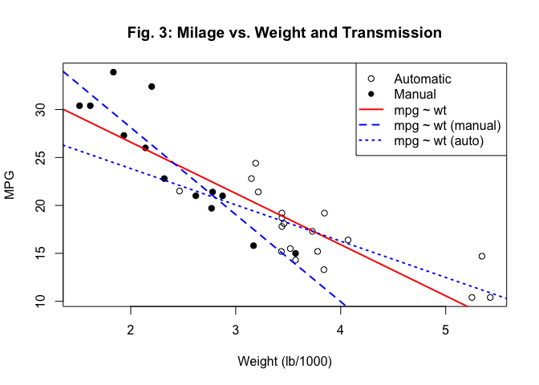
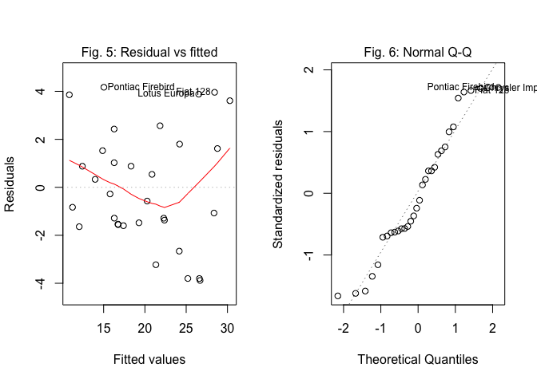

# Motor Trends: Effect of car transmission type on milage
rcblt@github.com  


## Executive Summary

In this brief report we analyzed the dataset ```mtcars``` from the 1974 Motor Trends magazine to evaluate the effect of the automatic or manual transmission on milage. In particular we were interested to evaluate which transmission is better for milage and quantify that difference. The dataset inclued data for 32 different car models from US and non-US makers.

From an initial exploratory data analysis we showed that there seems to be a significant difference in milage between cars with automatic and manual transmission (Fig. 1). However, a closer look at other variables considered in the dataset showed ast two counfounders: car weight and number of engine cylinders (Fig. 2, 3 and 4). Car weight appeared to explain both milage and transmission type (Fig. 5).

We derived a set of linear models of increasing complexity following a step-wise approach using a simple ANOVA to test whether a more complex model better explained the correlation with milage.

We selected two models, one included transmission type the other without it. According to the model diagnostics the two models explained the variation in milage similarly, the one without transmission being slightly better. However, using the model with transmission as a predictor we could estimate that keeping all the other variables constant switching from manual transmission to automatic would yeld a decrease in milage of ``11.1`` mpg.

## Results

### Linear models of considering car weight and transmission. 


Fitting a linear model to predict milage given car weight and type of transmission (automatic: ```am= 0``` and manual: ```am= 1```) we derived that the expected increase in mpg between automatic and manual holding the other variables constant is ``11.093``mpg. ANOVA test showed that adding transmission type to weight did not improved the model, however including the interaction term of the two predictors significantly improved the initial one-variable model. The resulting formula for this model usign R syntax is: ```mpg ~ wt * am```.


### Linear models considering car weight and number of cylinders


A linear model based on the number of cylinders and weight as predictor significantly improved the simpler model with just weight, the interaction term improved even more. However, in this case, adding transmission type either as an additional or third interaction term did not improved the model at all. The resulting formula for this model usign R syntax is: ```mpg ~ wt * cyl```.


### Comparison of the two linear models

Comparison of the two selected models showed very similar results both in terms of adjusted $R^2$ (model with transmission: 0.815, model without transmission: 0.846), normality of the residuals (Fig. 7 and 8) and possible bias remaining after fitting (Fig. 9 and 10).

## Discussion

The initial exploratory data analysis showed that difference in milage between automatic and manual transmission is actually explained by other counfounding variables that correlated with both milage and transmission type. P-values proved that differences are generally highly significant. However, since no formal checks of the condition under which a T-test statistics can be used have been performed, one should consider T-test results more as qualitative than quantitative results. Common sense and exploratory analysis indicated that weight and number of cylinders most likely are the counfounders between milage and transmission. A heavier car will probably consume more than lighter ones as well as the more cylinders in the engine the more fuel is consumed the less milage is obtained. At the same time heavier, bigger and more expensive cars with larger engines are more likely to be equipped with automatic transmission than smaller cars (Fig. 2, 3 and 4). This was also confirmed by an initial set of T-test to check whether the differences in milage and weight were statisticall significant for different number of cylinders and transmission type. The graphs in Figures 5 and 6 -where milage is plotted against weight considering transmission type and cylinders as factor respectively- further confirmed the considerations above. Model selection started including weight as predictor and adding more predictors step by step in order to improve the model. ANOVA tests was used to check whether more complex models actually yelded better models. Both models obtained at the end of the process included interactions terms with weight to explain the fact that weight and cylinders or transmission type are not independent. Evaluation of the two models gave similar numbers, therefore we selected the model that included transmission type as a way to predict the average difference in milage between cars with and withoug automatic transmissions.

## Methods

We applied the commonly used methods for the initial exploratory data analysis of the ```mtcars``` dataset. A graphical overview of the distribution of milage values for different transmission types, number of cylinders and weight. We used simple T-test for hypothesis testing to assess the statistical significance of the differences shown by the plots. However, no formal check of the distribution of data under test have been performed, so results from the T-test should be considered as qualitative only. Selection of the initial combination of predictors for the linear models followed an euristical approach based on common sense and the outcome from the exploratory analysis. Comparison and diagnostics of the candidate linear models were based on incremental ANOVA test to check whether more complex models actually improved the prediction and the residuals. We used the model diagnostic tools available in R to check the distribution of residuals, normality and leverage, both one model at a time and for comparison of the two models.

## Conclusions

Based on an initial exploratory analysis we identified that (at least) car weight is a counfounder when considering the correlation between transmission type and milage. We defined and checked different linear models to predict milage given the car weight, number of cylinders and transmission type.

Two equivalent models were compared: one included transmission type as a predictor, one without transmission type. From the ```mtcars``` dataset and using the first model we estimated that on average cars with manual transmission has a milage of ``11.1`` mpg greater than automatic ones, keeping all other variable constant.

Finally, to obtain more reliable results one should consider to collect data from a sample of car data where the same make and model is measured both with and without automatic transmission in order to minimize the counfounding factor of other variables.

### References

The complete R-Markdown source code and plots of this report are available on [rcblt GitHub page](https://github.com/rcblt/RegModels_Project)

## Appendix

      

