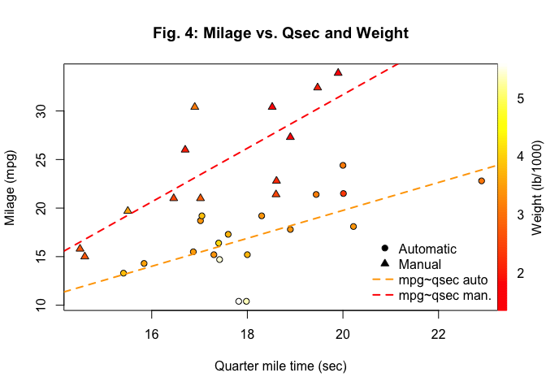

# Motor Trends: Effect of car transmission type on milage
rcblt@github.com  


## Executive Summary

In this brief report we analyzed the dataset ```mtcars``` from the 1974 Motor Trends magazine to evaluate the effect of the automatic or manual transmission on milage. In particular we were interested to evaluate which transmission is better for milage and quantify that difference. The dataset inclued data for 32 different car models from US and non-US makers.

From an initial exploratory data analysis we showed that there seems to be a significant difference in milage between cars with automatic and manual transmission (Fig. 1). However, a closer look at other variables considered in the dataset showed at least one counfounder: car weight (Fig. 2). Car weight appeared to correlate with both milage and transmission type (Fig. 3).

In order to understand the effect of transmission type to milage we started from a multivariable linear model comprising all other variables as predictors and repeatedly removed the least significant one until the mimimal set of significant predictors was obtained.

We obtained a model that used weight, quarter mile time and transmission as predictors, all with being very significant as reported by a simple ANOVA test.

Using the model we could estimate that keeping all the other variables constant switching from automatic to manual transmission would yeld a increase in milage of ``4.3`` mpg, $CI_{95\%}=($ ``2.2, 6.39`` $)$.

## Results

### Linear models of considering car weight, seconds to quarter mile and transmission type. 


```
## lm(formula = mpg ~ wt + qsec + am - 1, data = mtcars)
```

Fitting a linear model without intercept to predict milage from car weight (wt), seconds to complete a quarter mile (qsec) and transmission type (am) we derived that the expected increase in mpg between manual and automatic transmission is ``4.3`` mpg with a 95% confidence interval (``2.2, 6.39``), keeping the other variables constant.

The three predictors showed to be highly statistically significant with an adjusted $R^2= 0.9858$.


```
##       Estimate Std. Error   t value     Pr(>|t|)
## wt   -3.185455  0.4827586 -6.598442 3.128844e-07
## qsec  1.599823  0.1021276 15.664944 1.091522e-15
## am    4.299519  1.0241147  4.198279 2.329423e-04
```

The linear model with the same predictor variables and the intercept resulted to have the transmission type barely significant, the intercept itself not significant and a lower $R^2 = 0.8336$ (data not shown).

Finally the standard R diagnostic plot of a linear model showed a distribution rather close to the normal (Fig. 6) and no evident bias in the residual plots (Fig. 5). However, the standardized residual plot showed a high variability not explained by the chosed predictors (Fig. 7).

## Discussion

The initial exploratory data analysis showed that difference in milage between automatic and manual transmission could be actually explained by other counfounding variables that correlated with both milage and transmission type. P-values proved that differences are generally highly significant. However, since no formal checks of the condition under which a T-test statistics can be used have been performed, one should consider T-test results more as qualitative than quantitative results. Common sense and exploratory analysis indicated that weight is likely to be one of the counfounders between milage and transmission. A heavier car will probably consume more than lighter ones. At the same time heavier, bigger and more expensive cars with larger engines are more likely to be equipped with automatic transmission than smaller cars (Fig. 1, 2 and 3). 

In addition to weight other variables could explain the difference in milage. In fact the time to complete a quarter mile (qsec) resulted to summarise quite well the effect of number of cylinders, displacement, rear axle ratio, gross engine power. Fig. 4 shows that there is a clear difference in milage for cars with or without automatic transmission as well as a relation between milage and both weight and qsec.

## Methods

We applied the commonly used methods for the initial exploratory data analysis of the ```mtcars``` dataset. A graphical overview of the distribution of milage values for different transmission and weight. We used simple T-test for hypothesis testing to assess the statistical significance of the differences shown by the plots. However, no formal check of the distribution of data under test have been performed, so results from the T-test should be considered as qualitative only. Then we plotted milage as a function of weight and transmission type to confirm there is a correlation between the two predictor variables.

In order to select the best linear model we applied an iterative approach starting from a model with all variables as predictors of milage. Then, we repeatedly removed the predictore with the worst (higher) P-value -as reported in the model estimated coefficients- from the list of predictors and recomputed the model. During this phase we kept the intercept for all the models. We continued to remove variables until we obtained a minimal set of statistically significant predictors. Finally, since the resulting model had the intercept value as not statistically significant we tested the same model without the intercept. This gave an even better model with higher $R^2$ and better P-values for all predictors. In particular the P-value for ```am``` improved a lot.

## Conclusions

Based on an initial exploratory analysis we identified that (at least) car weight is a counfounder when considering the correlation between transmission type and milage. We defined and checked different linear models to predict milage from the other variables in the dataset.

Applying an interative process to reduce the number of predictor to the minimum set we obtained a model that used weight, seconds to complete a quarted mile and transmission type. We estimated that on average cars with automatic transmission has a milage of ``4.3`` mpg greater than manual ones, keeping all other variable constant.

Finally, since it appears that many variables are confounders between milage and transmission, in order to obtain more reliable results one should consider to collect data from a sample of car data where the same make and model is measured both with and without automatic transmission. This would greatly minimizethe counfounding factor of other variables.

### References

The complete R-Markdown source code and plots of this report are available on [rcblt GitHub page](https://github.com/rcblt/RegModels_Project)

## Appendix

      

